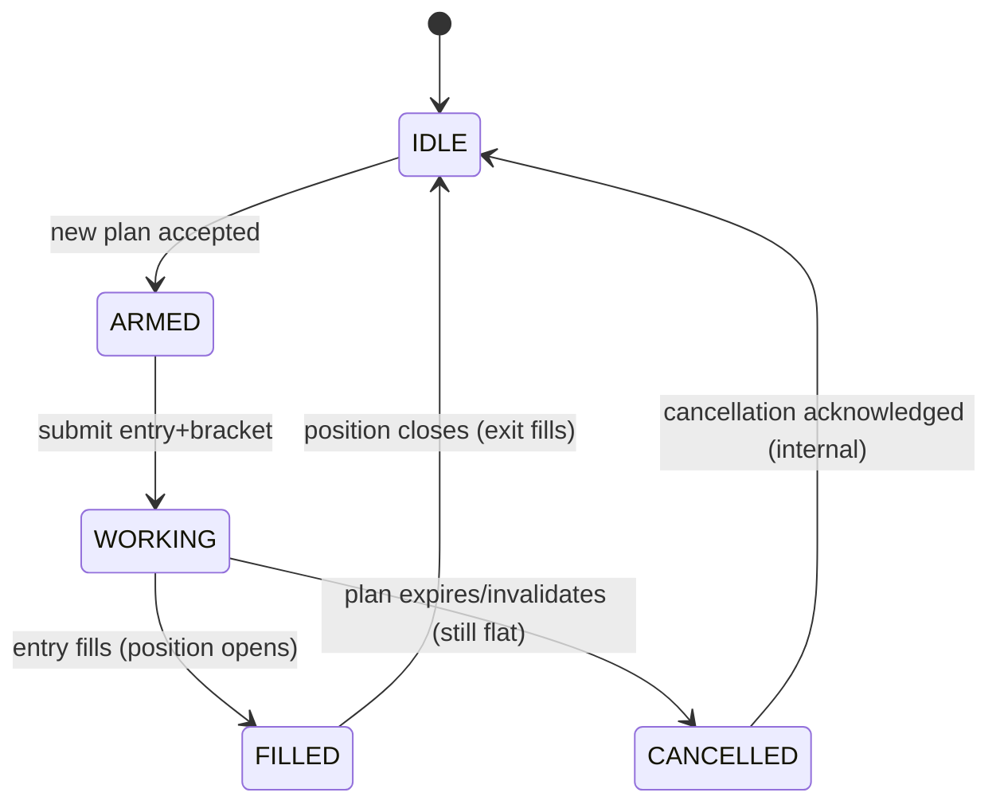
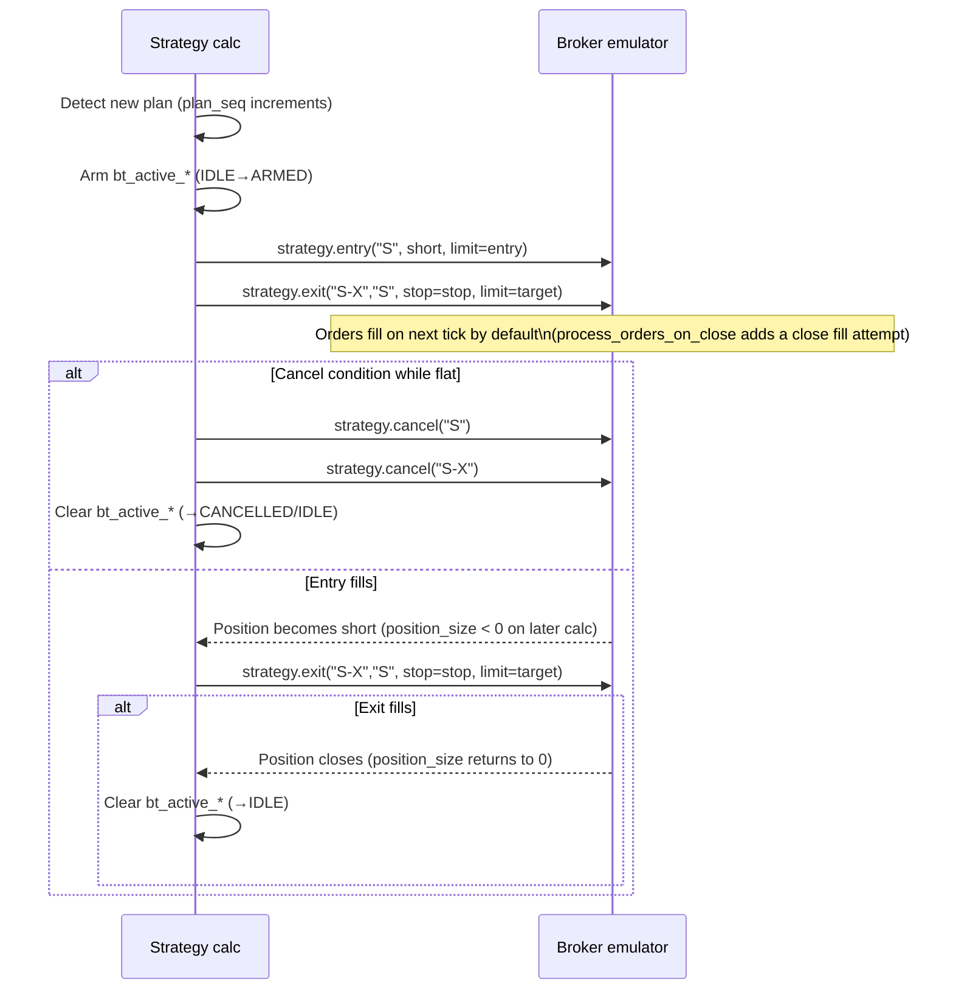

# Order Placement and Cancellation Logic Review for 2CiC State BT

## Executive summary

The reviewed codebase is a single **Pine Script v6** strategy (“2CiC State BT”) with an internal state machine that detects a setup and then manages one short **limit** entry order (“S”) plus a bracket-style exit (“S-X”) using `strategy.entry`, `strategy.exit`, and `strategy.cancel`. fileciteturn0file0

Your order logic is directionally sound and mostly idempotent (reissuing the same order IDs each calculation), but there are several **high-impact correctness and realism risks** rooted in (a) how the **broker emulator** fills orders and (b) how your own `bt_*` state variables can desynchronize from emulator state on realtime recalculations.

Key findings:

- **Order behavior depends strongly on TradingView’s broker emulator model**, including its OHLC-based intrabar price-path assumptions and its “next tick” fill constraint. If you don’t model these explicitly in your strategy settings and your own state machine, fills and cancels can look correct but still be systematically optimistic or temporally misaligned. citeturn10view0turn6view2turn10view3  
- **Reentrancy risk on realtime bars**: with `calc_on_every_tick=true`, your “edge triggers” (`plan_seq_now > plan_seq_now[1]`, etc.) stay *true for the entire realtime bar*, which can cause multiple “arm → cancel → rearm” cycles within one bar if your state resets to IDLE during the same bar. This is a classic “same-bar retrigger” issue in event-driven systems. citeturn10view2turn10view3  
- **Cancellation logic is coarse-grained and state-blind**: you cancel by ID without reconciling whether the broker emulator still has pending orders, and you clear internal state even if you did not actually have a pending order tracked, which can hide bugs and complicate auditability. (Note: `strategy.cancel()` cancels *all* unfilled orders with the specified ID; if multiple exist, it cancels them all.) citeturn6view2turn1view0  
- **Realism settings are under-specified** for a limit-entry strategy: you do not set `backtest_fill_limits_assumption` or `slippage`, even though TradingView exposes both and they materially change historical limit and stop fills. citeturn10view3turn6view2  

The rest of this report explains what the current lifecycle does, where it can fail under realistic sequencing, and how to harden it with concrete diffs, test cases, and a verification checklist.

## Code structure and readability

The script combines three conceptual layers in one file:

- **Signal & plan generation** (multi-timeframe, multi-symbol “dyad” logic + state machine for setup detection).
- **Backtest order manager** (the `bt_*` variables and logic that decides when to arm, submit, cancel, and reset).
- **Visualization/diagnostics** (labels, lines, and a debug table that surfaces state and counters).

This architecture is workable in Pine’s single-file model, but it makes order correctness harder to reason about because order side-effects (calls to `strategy.*`) are interleaved with signal updates and with chart rendering.

Two structural improvements directly reduce order bugs:

- **Extract an “order manager” function** whose *only* responsibility is to compute desired orders from a normalized “trade plan” and reconcile them against a minimal internal order state. This makes it easier to enforce invariants like “at most one pending entry order at a time” and “do not re-arm the same plan twice in the same bar.”
- **Make IDs and state transitions explicit** with named constants and with a single “source of truth” for the current plan (e.g., `bt_active_plan_seq`, `bt_active_plan_ts`, `bt_active_cancel_ts`). `strategy.cancel()` is ID-based; your internal state should be ID- and plan-linked as well. citeturn6view2  

Even though Pine is not a general-purpose language, its execution model is deterministic and sequential; the main readability goal is therefore to make **sequencing** and **idempotency** obvious to a reader. citeturn1view3  

## Order lifecycle review for entity["company","TradingView","charting platform"] strategy code

### Current order lifecycle as implemented

At a high level, your lifecycle has these phases:

1. **Plan appears**: a new plan is detected (`bt_new_trade_plan`) while inside the allowed time window (`bt_within_c3_window`), and the candidate entry/stop/target/qty pass validation.
2. **Arm**: internal `bt_active_*` fields are set and `bt_order_state` moves from IDLE → ARMED.
3. **Submit / keep alive**: while flat and not cancelling, you reissue:
   - `strategy.entry("S", strategy.short, qty=..., limit=...)`
   - `strategy.exit("S-X", "S", stop=..., limit=...)`
4. **Cancel**: while flat, if invalidated/expired/out-of-window/not-valid, you call:
   - `strategy.cancel("S")`
   - `strategy.cancel("S-X")`
   then clear `bt_active_*` and mark state CANCELLED (then soon after back to IDLE).
5. **Fill detection**:
   - If `strategy.position_size` becomes negative, you count a fill and mark FILLED.
   - When position closes (position goes from <0 → 0), you clear `bt_active_*` and return to IDLE.

This is consistent with the fact that Pine strategies place/modify/cancel orders through the `strategy.*` namespace and the broker emulator simulates their execution. citeturn1view0turn6view2  

### “Current vs recommended” behavior table

| Dimension | Current behavior | Risk | Recommended behavior |
|---|---|---|---|
| Plan → order mapping | A new plan arms only when `bt_order_state == IDLE` | A new plan arriving while an old pending order exists is silently ignored, leaving stale intent | Store `bt_active_plan_seq`; if plan changes while pending, **cancel-and-replace** deterministically |
| Cancel semantics | Always calls `strategy.cancel("S")` and `strategy.cancel("S-X")` when flat and cancel condition true | Cancels *all* unfilled orders with those IDs; may mask multiple-order bugs or cancel more than intended | Cancel only the relevant IDs; add invariant checks to ensure there cannot be multiple pending orders with the same ID |
| Fill timing awareness | Uses `strategy.position_size` transitions; no `calc_on_order_fills` | Fill becomes visible only on next calc; state can lag the emulator | Consider `calc_on_order_fills` so post-fill logic can run immediately after fills (especially for bracket management) citeturn10view3 |
| Realtime reentrancy | `calc_on_every_tick=true`, but order signals are bar-delta based | Same-bar retriggers can occur; tick history loss implies repaint on reload | Gate “plan consumed” with latches (per plan_seq) and optionally use `barstate.isconfirmed` to restrict trading to confirmed bars citeturn10view2turn10view3 |
| Limit fill realism | Defaults (no `backtest_fill_limits_assumption`) | Historical limit fills can be permissive | Set `backtest_fill_limits_assumption` intentionally; add slippage for stops/markets citeturn10view3 |

### Mermaid state diagram of the intended order manager



This is accurate *as a control intent*, but in TradingView the broker emulator is the arbiter of “actually pending” vs “actually filled,” and your internal state should be treated as a cache that must remain idempotent across recalculations. citeturn10view0turn1view3  

## Timing and sequencing risks

### Broker emulator assumptions that materially affect your strategy

TradingView’s broker emulator **infers intrabar movement from OHLC** using a heuristic ordering (either open→high→low→close or open→low→high→close depending on where the open is). It also treats any price within the high-low range as reachable, and handles gaps for price-based orders by filling at the bar open if the crossing occurs in the close→open gap. citeturn10view0

This has several implications for your short limit entry:

- A short limit that is “touched” by `high >= limit` (your debug test) is not the same as a *realistic* fill. Even within the broker emulator, fill prices can be affected by gap assumptions. citeturn10view0  
- “Limit orders avoid slippage” is not generally true; even if the price reaches the limit level, a real order can fail to fill due to liquidity/queueing, which the emulator cannot fully model. citeturn6view2  

### The “next tick” rule, process-on-close, and why state lags matter

By default, the earliest an order can fill is the **next available tick**, because creating and filling on the same tick is considered unrealistic in the emulator model. Since strategies normally calculate once per bar close, that “next tick” is often the next bar open. citeturn6view2turn1view2  

You set `process_orders_on_close=true`, which adds an extra attempt to execute orders *after* the bar closes and calculations complete, enabling same-close fills (with realism caveats). citeturn10view3turn1view2  

However:

- If you do not enable “After Order is Filled” / `calc_on_order_fills`, then even if the broker emulator fills on that extra attempt, your script will not automatically re-run immediately after the fill, so `strategy.position_size` changes are typically visible only on a later calculation. citeturn10view3  
- This creates a window where your internal state still believes it is “WORKING while flat,” and can do inappropriate actions (e.g., attempt cancellation) if your cancel condition becomes true in that lag window.

### Realtime-only: `calc_on_every_tick` and same-bar retriggers

`calc_on_every_tick` changes **realtime** behavior: on realtime bars, the script recalculates on each new tick. It does not make historical backtests truly tick-accurate because historical feeds do not contain full tick data; TradingView warns about repainting and limitations. citeturn10view2turn10view3  

In your strategy, this creates a specific sequencing hazard:

- Edge-trigger booleans like `plan_seq_now > plan_seq_now[1]` remain true for the entire realtime bar, because `[1]` refers to the prior bar, not the prior tick.
- If during one of those intra-bar recalculations you cancel and reset `bt_order_state` back to IDLE (you do reset CANCELLED → IDLE while still in the same bar), then the **next tick of the same bar** can re-enter the “arm” branch again, causing repeated cancel/re-arm churn.

This is the Pine equivalent of an event-loop handler that is not reentrancy-safe.

### Multi-timeframe sequencing with `request.security`

Your setup logic is imported from a 15-minute context via `request.security(..., "15", ...)`. Two official caveats matter here:

- `request.security()` is intended for **equal or higher** timeframes; when used to fetch lower timeframe data, it returns only **one** lower-timeframe bar’s result per chart bar by default. citeturn12view1  
- `lookahead` handling is a major source of backtest bias; `lookahead_off` is the non-leaking default, whereas lookahead-on without offset can leak future data. citeturn12view0  

Net: the exact chart timeframe you run this strategy on will change *when* a plan becomes visible to the order manager and therefore change order insertion/cancellation timing. If you want the order manager to be robust, you should make its assumptions explicit: “I treat plan updates as occurring only on confirmed 15m closes,” or “I allow intrabar plan emergence but guard against reentrancy.”

### Mermaid timeline of current order lifecycle events



The key weakness is that the strategy-side state changes (“I’m filled,” “I’m cancelled”) are not synchronized to emulator event timing unless you explicitly configure recalculation after fills. citeturn10view3turn6view2  

## Concurrency, state management, and edge cases

### Concurrency model and where “race conditions” still exist

Pine scripts execute sequentially across bars/ticks (not multi-threaded), but you can still get race-condition-like bugs because:

- The broker emulator applies fills after script calculations (and optionally after the extra process-on-close attempt). citeturn10view3turn6view2  
- Your internal variables (`bt_*`) are persistent across executions, so a stale cached interpretation can “win” over reality for one or more calculations.

Treat this as an **asynchronous boundary**: strategy code emits intents; the emulator later emits fills/cancellations; you observe them via `strategy.position_size` and related built-ins on the next calculation.

### State management risks in the current order manager

1. **Plan identity is not persisted with the order.**  
   You store `bt_last_traded_stage1_seq` but do not use it to gate re-trading. More importantly, you do not store `bt_active_plan_seq`. If plan_seq changes while an order is pending, your state machine cannot know whether the current pending order corresponds to the current plan or a stale one.

2. **Cancellation resets are too eager.**  
   You clear `bt_active_*` and then quickly return CANCELLED → IDLE when flat. This is fine on historical bars (one calc per bar), but dangerous on realtime bars with tick recalculation. citeturn10view2turn10view3  

3. **Multiple-unfilled-order possibility is not defended.**  
   TradingView notes that `strategy.cancel(id)` cancels all unfilled orders with that ID; if you ever ended up with more than one pending order sharing an ID, you would silently cancel them all. citeturn6view2  
   That “shouldn’t happen” is not a guarantee—especially with price-based orders and multiple recalculations.

### Edge cases against the requested list

- **Partial fills**: TradingView’s standard broker emulator model does not expose partial fill mechanics the way an exchange API does; your logic implicitly assumes atomic fills via `strategy.position_size` jumps. Your Python backtester will need explicit partial fill state and reconciliation (remaining_qty, avg_price, etc.). citeturn10view0turn6view2  
- **Slippage**: You currently do not configure `slippage`. The emulator can add tick-based slippage to market/stop orders via strategy properties. For stops (your exit stop component), not modeling slippage can materially overstate performance. citeturn10view3  
- **Latency / bar gaps**: For price-based orders, the emulator fills at the bar open if the crossing occurs between bars; this is effectively a latency + gap model that affects both entries and exits. citeturn10view0  
- **Duplicate orders**: Your reuse of fixed IDs mitigates duplicates, but same-bar retrigger (rearm after cancel within the same realtime bar) can still create churn and unpredictable outcomes. citeturn10view2  
- **Reconnects**: Pine has no “reconnect” API surface; however, tick data loss on refresh and potential repaint implies that stateful realtime behavior is not stable across reloads. citeturn10view2turn10view3  
- **API contract assumptions**: In this environment, the “API contract” is the broker emulator + strategy settings: next-tick fill, OHLC-based intrabar model, cancel semantics by ID, and request.security alignment rules. citeturn10view0turn6view2turn12view1  

## Recommended code changes with concrete diffs

The changes below are prioritized for **order correctness first**, then realism, then observability.

### Add plan identity, consume-once latching, and cancel-and-replace

Goal: ensure you never arm the same plan twice on the same bar/tick stream, and ensure stale pending orders are cancelled if a new plan supersedes them.

```diff
@@
 const int BT_ORDER_IDLE = 0
 const int BT_ORDER_ARMED = 1
 const int BT_ORDER_WORKING = 2
 const int BT_ORDER_FILLED = 3
 const int BT_ORDER_CANCELLED = 4

+const string ENTRY_ID = "S"
+const string EXIT_ID  = "S-X"

@@
 var int bt_order_state = BT_ORDER_IDLE
 var int bt_last_reject_code = BT_REJECT_NONE
+var int bt_active_plan_seq = 0
+var int bt_last_plan_seq_consumed = 0
+var int bt_last_cancel_bar_index = na

@@
 bool bt_new_trade_plan = plan_seq_now > nz(plan_seq_now[1], 0)
+bool bt_plan_unconsumed = plan_seq_now != bt_last_plan_seq_consumed

@@
-if bt_new_trade_plan and bt_within_c3_window
+// Consume a new plan at most once per bar close (prevents same-bar retriggers on realtime ticks)
+bool bt_can_arm_now = bt_new_trade_plan and bt_plan_unconsumed and barstate.isconfirmed
+if bt_can_arm_now and bt_within_c3_window
     if not bt_trade_on_this_chart
         ...
     else if strategy.position_size == 0 and bt_order_state == BT_ORDER_IDLE and bt_candidate_valid
         bt_active_entry_limit := bt_candidate_entry_limit
         bt_active_qty := bt_candidate_qty
         bt_active_stop := bt_candidate_stop
         bt_active_target := bt_candidate_target
         bt_active_cancel_ts := bt_candidate_cancel_ts
         bt_order_placed_ts := bt_candidate_ts
-        bt_last_traded_stage1_seq := stage1_seq_now
+        bt_active_plan_seq := plan_seq_now
+        bt_last_plan_seq_consumed := plan_seq_now
         bt_order_state := BT_ORDER_ARMED
         bt_last_reject_code := BT_REJECT_NONE

@@
-bool bt_should_cancel_pending = expired_now or invalidated_now or not bt_pending_within_c3_window or not bt_setup_still_valid_for_pending
+bool bt_plan_changed_while_pending = bt_has_pending_order and bt_active_plan_seq != plan_seq_now and plan_seq_now > 0
+bool bt_should_cancel_pending =
+     expired_now or invalidated_now or
+     not bt_pending_within_c3_window or
+     not bt_setup_still_valid_for_pending or
+     bt_plan_changed_while_pending

 if strategy.position_size == 0
     if bt_should_cancel_pending
-        strategy.cancel("S")
-        strategy.cancel("S-X")
+        strategy.cancel(ENTRY_ID)
+        strategy.cancel(EXIT_ID)
+        bt_last_cancel_bar_index := bar_index
         if bt_has_pending_order
             ...
         bt_order_state := BT_ORDER_CANCELLED
     else if bt_has_pending_order
         bool bt_first_submit_now = bt_order_state != BT_ORDER_WORKING
-        strategy.entry("S", strategy.short, qty=bt_active_qty, limit=bt_active_entry_limit, comment="2CiC Stage3 LMT")
-        strategy.exit("S-X", "S", stop=bt_active_stop, limit=bt_active_target)
+        strategy.entry(ENTRY_ID, strategy.short, qty=bt_active_qty, limit=bt_active_entry_limit, comment="2CiC Stage3 LMT")
+        strategy.exit(EXIT_ID, ENTRY_ID, stop=bt_active_stop, limit=bt_active_target)
         if bt_first_submit_now
             bt_orders_armed_count += 1
         bt_order_state := BT_ORDER_WORKING

@@
-if bt_order_state == BT_ORDER_CANCELLED and strategy.position_size == 0 and na(bt_active_entry_limit) and na(bt_active_qty)
-    bt_order_state := BT_ORDER_IDLE
+// Do not immediately go CANCELLED→IDLE within the same bar (avoids rearm churn on realtime ticks)
+bool bt_safe_to_reset_cancelled = bt_order_state == BT_ORDER_CANCELLED and strategy.position_size == 0 and na(bt_active_entry_limit) and na(bt_active_qty)
+if bt_safe_to_reset_cancelled and bar_index != bt_last_cancel_bar_index
+    bt_order_state := BT_ORDER_IDLE
```

Why this matters:

- `barstate.isconfirmed` is the most conservative way to ensure you act on bar-close information only; it also makes your forward-test behavior closer to your historical behavior when you’re not truly modeling tick-level microstructure. citeturn10view2turn1view3  
- The “delay CANCELLED→IDLE by one bar” prevents same-bar retriggers when `calc_on_every_tick` is enabled.

If you *want* intrabar behavior, you can replace `barstate.isconfirmed` with a more nuanced latch (e.g., track last processed realtime timestamp), but you still need some form of “consume once” guarantee.

### Fix the reject counter bug and improve rejection taxonomy

In your current code, a qty failure increments the levels reject counter. Make the taxonomy explicit.

```diff
@@
 var int bt_reject_side_count = 0
 var int bt_reject_levels_count = 0
+var int bt_reject_qty_count = 0

@@
 else if not bt_candidate_qty_ok
-    bt_reject_levels_count += 1
+    bt_reject_qty_count += 1
     bt_last_reject_code := BT_REJECT_QTY
```

This is not purely cosmetic: in order systems, “invalid price ladder” and “invalid size” tend to have different root causes and different downstream handling.

### Make fill realism settings explicit in `strategy()` declaration

Because you rely on price-based orders (limit entry, stop/limit exits), two strategy properties are especially relevant:

- `backtest_fill_limits_assumption`: makes historical limit fills stricter. citeturn10view3  
- `slippage`: adds tick slippage to market/stop orders; relevant for your stop-loss leg. citeturn10view3  

Also consider:

- `use_bar_magnifier`: uses lower timeframe prices for more realistic historical fills. citeturn10view3  
- `calc_on_order_fills`: recalculates immediately after fills (reduces state lag issues). citeturn10view3  

Example (values illustrative—should be tuned per market):

```diff
 strategy("2CiC State BT",
     ...
-    process_orders_on_close=true, calc_on_every_tick=true,
+    process_orders_on_close=true,
+    calc_on_every_tick=false,
+    calc_on_order_fills=true,
+    use_bar_magnifier=true,
+    backtest_fill_limits_assumption=2,
+    slippage=1,
     ...)
```

Be careful: TradingView explicitly warns that entering on the same tick the order is created (which `process_orders_on_close` enables) can be misleading for real trading. citeturn10view3turn1view2  

### Improve observability with “order intent vs observed state” logging

You already have a debug table and counters. The next level is to log and/or display:

- The **active plan identity** (`bt_active_plan_seq`) and whether it matches the current `plan_seq_now`.
- The **desired order intent** (entry/stop/target/qty/cancel_ts).
- The **observed position/trade info** from strategy built-ins (e.g., `strategy.position_size`, and, where useful, trade metrics via `strategy.opentrades.*`). citeturn10view1  

This makes it possible to diagnose the most pernicious class of bugs: “my internal state says the order is cancelled, but the emulator still filled it later,” or “I replaced a plan but didn’t cancel the old pending order.”

If you need hard failure on invariant violations, Pine supports runtime errors (commonly used in docs to enforce safe conditions). citeturn12view1  

## Tests to add, prioritized action list, and order-behavior checklist

### Testing strategy to add

Pine is not designed for unit-test suites, but you can still test order behavior systematically in two layers:

1. **Scenario-based backtest fixtures (Pine / Strategy Tester)**  
   Use deterministic replay ranges and validate:
   - exactly one pending entry per plan
   - cancellation occurs before the expiry timestamp
   - no re-arming of the same plan within one bar (especially on realtime bars with tick recalculation)

2. **A Python reference harness (recommended even if production stays in Pine)**  
   Since your original request anticipates Python backtesting, a small Python “reference order manager” mirroring your Pine order state machine is valuable. It allows:
   - unit tests for lifecycle transitions (pure functions)
   - integration tests with a simulated broker/backtester interface
   - property-based tests that search edge-case sequences automatically

Property-based testing is well suited for order-lifecycle logic because order managers are essentially state machines over event streams; this approach originated with tools like QuickCheck. citeturn14view4turn13view3  
In Python, Hypothesis provides the same conceptual model (“tests should pass for all inputs in a described range” and it hunts edge cases). citeturn9search2  

### Specific test cases

The list below is intentionally concrete, phrased as “Given / When / Then” so it can be implemented in either Pine scenarios or a Python harness.

- **Single-plan happy path**: Given one plan (entry/stop/target/cancel_ts), when price touches entry before cancel_ts, then exactly one entry fills and exactly one exit closes the position, and internal state returns to IDLE. (Validate fill and close times against the emulator’s “next tick” behavior.) citeturn6view2turn1view2  
- **Expiry cancellation**: Given a plan where price never touches entry, when time_close crosses cancel_ts, then entry is cancelled and cannot fill later. (Validate that `strategy.cancel(id)` cancels unfilled orders by ID.) citeturn6view2  
- **Invalidation cancellation**: Given a plan that becomes invalidated while flat, then the pending entry must be cancelled once and internal state must not re-arm the same plan within the same bar. citeturn10view2  
- **Plan supersession**: Given plan A arms an order, when plan B arrives before A fills, then the system cancels A and replaces with B (or explicitly ignores B—either is acceptable, but must be deterministic and testable).  
- **Realtime reentrancy regression**: With tick recalculation enabled, simulate a same-bar sequence where cancel condition becomes true and then false again; ensure you do not generate multiple submit/cancel cycles in the same bar. citeturn10view2turn10view3  
- **Gap-through fill behavior**: Construct a bar where the market gaps across the limit/stop level between close and open; validate that price-based orders fill at the bar open per emulator rules, not at the specified price. citeturn10view0  
- **Limit fill strictness**: Run the same scenario with different `backtest_fill_limits_assumption` values and assert expected differences in whether a within-bar limit fill occurs. citeturn10view3  

### Performance and scalability implications

Your order subsystem itself is not a performance bottleneck (one entry + one exit update per bar), but **higher realism settings**—especially bar magnifier—can increase backtest cost. TradingView explicitly frames bar magnifier as using lower timeframe prices to improve realism. citeturn10view3  

If you port to Python, the scalability bottleneck usually becomes:

- event throughput (ticks/bars)
- order book simulation fidelity
- logging volume (especially per-tick structured logs)

### Security and error handling notes

In Pine, “security” is mostly about correctness and safe handling of `na`/invalid symbol contexts; you already use `ignore_invalid_symbol=true` in requests, which prevents hard failures but can hide silent data gaps (a trade-off). In a Python live-trading stack, security becomes more literal: API key storage, request signing, idempotency, and replay protection. The order-manager hardening recommended above (plan identity, consume-once semantics) is also the foundation for idempotent client-order IDs in live APIs.

### Prioritized action list

1. **Make order actions consume-once per plan** (latch `plan_seq_now` and avoid same-bar retriggers).  
2. **Tie pending orders to plan identity** (`bt_active_plan_seq`) and implement deterministic cancel-and-replace behavior for plan supersession.  
3. **Stop resetting CANCELLED→IDLE in the same bar**; delay by one bar (or one tick) to prevent reentrancy churn under `calc_on_every_tick`.  
4. **Explicitly configure backtest realism knobs**: `backtest_fill_limits_assumption`, `slippage`, and (if appropriate) `use_bar_magnifier` and `calc_on_order_fills`. citeturn10view3  
5. **Add an “order intent vs observed state” audit surface** (debug table/logs) so you can diagnose desyncs quickly. citeturn10view1  
6. **Implement the scenario test suite** (Pine replay scenarios now; Python harness later), including a regression specifically for realtime reentrancy. citeturn9search2turn14view4  

### Checklist for verifying correct order behavior

Use this as a pre-merge checklist for any change that touches order logic:

- A new plan is consumed exactly once and cannot re-arm within the same bar/tick stream.
- At most one pending entry order logically exists at any time; if this is violated, it is observable (logged) and/or fails fast.
- Every cancellation has a clear reason code (expired, invalidated, out-of-window, plan superseded).
- Cancel-and-replace behavior (if enabled) is deterministic: old plan orders cannot fill after replacement.
- Fill detection is aligned with emulator timing (next tick / process-on-close), and state transitions cannot execute “cancel pending” on the same calculation that should observe “filled,” unless intentionally designed with `calc_on_order_fills`. citeturn10view3turn6view2  
- Limit fills and stop fills are tested under at least one non-zero slippage and a non-default limit assumption to evaluate sensitivity. citeturn10view3  
- Multi-timeframe plan visibility is understood for the chosen chart timeframe; requests do not introduce repaint or time-alignment errors. citeturn12view1turn12view0  
- Backtest results are interpreted with awareness of overfitting risk; if many variants are tried, use a disciplined evaluation scheme (e.g., CSCV/PBO-style thinking) before trusting performance. citeturn14view1turn13view0  
- Execution cost realism is acknowledged for any strategy intended to scale (market impact / transaction cost trade-offs are non-negligible in real execution). citeturn14view2turn14view3turn13view1turn13view2