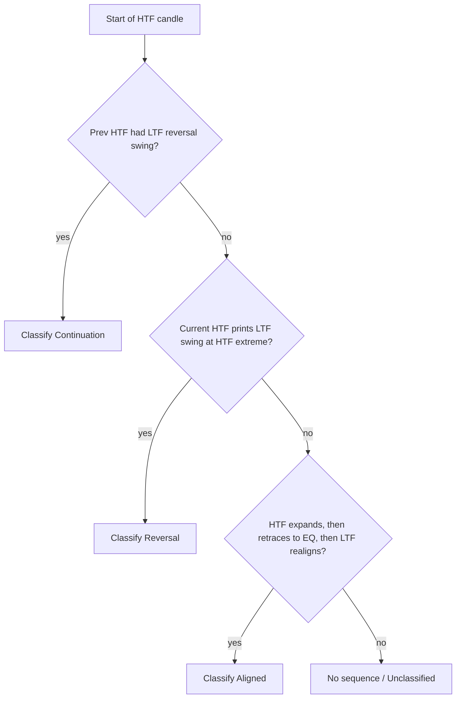
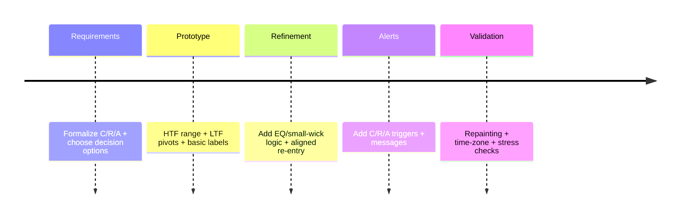

# The GxT Mechanical H4 Model Specifications

## Purpose and scope
The **GxT Mechanical H4 Model** is a rules-based framework for **intraday confirmations** that “profiles” a **higher-timeframe candle (HTF)**—shown in the video using **4-hour (H4)**—using **lower-timeframe (LTF) swing/fractal structure** to classify behavior into **three repeatable sequences**: **Continuation**, **Reversal**, and **Aligned (re-alignment / re-entry)**.

The model’s scope in the source is explicitly **multi-timeframe** (H4 profiled with LTF swings) and adaptable to other HTFs (e.g., daily), but the canonical implementation described is **H4 intraday**.

## Core concepts and definitions
### Timeframes and candle “profiling”
- **HTF candle (default H4)**: the candle being profiled.
- **LTF swing/fractal**: a swing point that “confirms” reversal and defines tradable direction “away from swing points.”  
- **Important implementation note**: In TradingView/Pine, time-derived fields (hour/day variables, etc.) are expressed in the **exchange time zone** and Pine scripts cannot access the chart’s user-selected time zone directly; if the model is keyed to New York times (e.g., “2 a.m.” / “6 a.m.” / “10 a.m.” in examples), a **user-configurable time zone** input is required.

### EQ (equilibrium / midpoint)
When the speaker says “mark out EQ” of a range, the mechanical interpretation is the **midpoint**:  
**EQ = (RangeHigh + RangeLow) / 2**.  
**Decision required:** exact range source(s) (previous day, current H4, prior session). The transcript uses prior day’s range EQ and current H4-range EQ in different places.

### “Small wick supports expansion”
The transcript repeatedly ties “small wick” to whether expansion is supported and whether a candle is “aligned.”  
**Decision required:** the quantitative threshold. Provide a parameterized definition:

**Option A (ratio-based, recommended for coding):**  
For a candle with range `R = High - Low` and body `B = abs(Close - Open)`:
- Lower wick = `min(Open, Close) - Low`
- Upper wick = `High - max(Open, Close)`
- “Small opposing wick” if `OppWick / R ≤ wickMaxPct` (e.g., 0.20–0.35).  

**Option B (EQ-respect heuristic, aligns with transcript language):**  
Bullish expansion support if the key reversal occurs in the **upper half** of the relevant range (price “respects EQ”); bearish vice versa.

### LTF swing (“fract model”) operationalization
The model depends on detecting swings. In Pine, the closest built-in analogue is `ta.pivotlow()`/`ta.pivothigh()`; these **confirm only after a fixed number of bars**, which creates inherent signal latency that must be acknowledged to avoid “repainting expectations.”  
**Decision required:** exact swing definition (lookback, market-structure displacement, etc.). Provide parameterized pivots: leftBars/rightBars.

## Sequence logic and state machine
The video defines three sequences. Below is the most literal conversion into **mechanical, testable rules**, with explicit decision points surfaced.

### Continuation sequence (C)
**Source definition (paraphrased):** A new H4 candle opens while the prior H4 candle has already created an LTF reversal/swing; the new H4 then “continues/expands” because of that reversal.

**Mechanical specification**
Let `HTF[n-1]` be the prior H4 candle, `HTF[n]` the current.
1. During `HTF[n-1]`, detect an LTF **reversal swing** in the direction of expected continuation:
   - Bullish continuation context: a confirmed **pivot low** occurs inside `HTF[n-1]`.  
   - Bearish continuation context: a confirmed **pivot high** occurs inside `HTF[n-1]`.
2. At the open of `HTF[n]`, classify as **Continuation** if “opens within the LTF swing created by the previous candle.”  
   **Decision required:** choose one:
   - **C1 (price containment)**: `HTF[n].open` is within the pivot bar’s high/low range.
   - **C2 (zone containment)**: `HTF[n].open` is within `[pivotPrice, postPivotSwingExtreme]`.
   - **C3 (time containment)**: the pivot’s formation time is within “LTF candle 3” of the prior H4; requires defining what “candle 3” means (likely the 3rd hourly candle of the 4).

### Reversal sequence (R)
**Source definition (paraphrased):** The H4 candle’s reversal is **formed from** an LTF swing; this confirms the extreme (low/high) and allows trading the expansion within that same H4 candle, especially when the candle profile has a “small wick.”

**Mechanical specification**
A candle `HTF[n]` is **Reversal** if:
1. `HTF[n]` is expected (by context) to be an expansion candle and has **expansion-supporting profile** (e.g., “small wick”).  
2. The HTF extreme is **created by** an LTF swing inside `HTF[n]`:
   - Bullish reversal: an LTF pivot low occurs, and that pivot low equals (or is within tolerance of) `HTF[n].low`.
   - Bearish reversal: analog for highs.  
3. The sequence differs from Continuation because the HTF candle **did not open inside** a pre-existing swing zone; the swing must be **printed by the current HTF candle**.

### Aligned sequence (A)
**Source definition (paraphrased):** The HTF candle is already “aligned” (already expanded away, reducing odds of becoming an opposite expansion candle). If price retraces and becomes “not aligned,” wait for an LTF swing to **realign** and then expect continuation within the same HTF candle if time/objectives remain.

**Mechanical specification**
1. **Precondition (already aligned)**: early in `HTF[n]`, price makes directional expansion consistent with the candle profile (e.g., movement away from opening area producing small opposing wick risk).  
   **Decision required:** implement as one of:
   - A1: price crosses and holds above/below `HTF[n].EQ`.
   - A2: price produces `m` consecutive LTF closes in the trend direction.
2. **Retracement phase**: price returns toward `HTF[n].EQ` / internal range area (explicitly described).
3. **Realignment trigger**: an LTF swing forms that signals resumption of the aligned direction (pivot low for bullish, pivot high for bearish).
4. **Time remaining gate (optional but faithful)**: only valid if “time left in the candle” (e.g., ≥ some minutes) and “open objectives” still exist.  
   **Decision required:** objective definition; see SMT/objectives module below.

## Implementation specification for a TradingView indicator
This section translates the model into an implementable spec for TradingView using Pine-compatible primitives (not strategy advice). MTF mechanics and repainting controls rely on documented Pine behavior.

### Inputs table
All inputs must be in the script’s Inputs UI per Pine conventions.

| Name | Type | Default | Range | Description |
|---|---:|---:|---:|---|
| HTF timeframe | timeframe | `"240"` | ≥ chart TF | Candle being profiled (H4 by default). |
| Swing timeframe | enum | `Chart TF` | — | LTF used for swings (chart TF) OR requested lower TF (advanced). |
| Pivot left bars | int | 2 | 1–20 | Swing sensitivity; larger = fewer swings. |
| Pivot right bars | int | 2 | 1–20 | Confirmation delay; larger = later signals. |
| Wick mode | enum | Ratio | Ratio/EQ | Choose “small wick” definition (Option A vs B). |
| Max opposing-wick % | float | 0.25 | 0.05–0.50 | Only used in Ratio mode. |
| EQ source | enum | HTF range | HTF/PrevDay/Custom | Choose which range midpoint defines EQ used by alignment logic. |
| Time zone | string | `syminfo.timezone` | IANA/UTC± | Needed to map “2am/6am/10am” windows. |
| Enable time windows | bool | true | — | If on, label only HTF opens that match configured windows. |
| Window times | string | `"02:00,06:00,10:00"` | — | Comma list; **decision required** (model gives examples only). |
| Enable SMT module | bool | false | — | Optional: correlation divergence confirmations described in examples. |
| SMT symbol A | symbol | current | — | Primary. |
| SMT symbol B | symbol | user | — | Comparator (e.g., another index/FX pair). |
| SMT lookback | int | 20 | 5–200 | Defines “sweep” reference window. **Decision required**. |
| Strength-switch TF | timeframe | `"60"` | ≤ HTF | Optional: detects “strength switching” candle divergence. |
| Show labels | bool | true | — | Sequence tags C/R/A. |
| Max labels | int | 200 | 50–500 | Must respect drawing limits. |

### Outputs table
Object/drawing counts must be bounded to avoid hitting platform limits.

| Output | Type | Style | Meaning |
|---|---|---|---|
| HTF High/Low | line/plot | solid | Reference range of active HTF candle. |
| HTF EQ | line/plot | dashed | EQ midpoint of selected range. |
| Sequence label | label | “C/R/A” | Classification per state machine. |
| Swing markers | shape/label | ▲/▼ | Confirmed LTF pivots used as “swing points.” |
| Optional SMT badge | label/table | text | Shows SMT detected / strength switch. |

### Alerts table
Alert triggers can be implemented via `alertcondition()` (static template messages) or `alert()` (dynamic, more flexible). The docs note the differences and constraints.

| Alert ID | Trigger | Default message |
|---|---|---|
| GXT_C | On first bar of HTF when C confirmed | “GXT Continuation: {{ticker}} {{interval}}” |
| GXT_R | When reversal swing confirming HTF extreme is confirmed | “GXT Reversal: {{ticker}} {{interval}}” |
| GXT_A | When realignment swing confirmed after retrace | “GXT Aligned: {{ticker}} {{interval}}” |

### Timeframe, repainting, and performance requirements
- **MTF retrieval**: Use `request.security()` to retrieve HTF OHLC/time series and avoid unsupported assumptions about lower TF data returned per bar.  
- **No future leak**: Avoid `lookahead_on` misuse; the repainting documentation explicitly shows how lookahead can “magically” show future HTF values on history unless handled safely.  
- **Pivot latency awareness**: Pivots confirm only after rightBars; labels must be placed with that known delay and documented as such (this is not “repainting,” it is confirmation lag).  
- **Resource limits**: Cap drawings and set `max_labels_count`/`max_lines_count` appropriately; hard limits are ~500 lines/boxes/labels and fewer shown by default.  
- **Compute gating**: Use bar state flags to postpone heavy updates to confirmed bars or last confirmed history when appropriate.

## Validation, acceptance criteria, and milestones
### Test and validation approach
Because Pine lacks a unit-test runner, validation is primarily **visual + scenario-based**:
1. **Golden-sample days**: Create a checklist from the video’s described patterns (continuation, reversal, aligned) and verify labels appear only after the required LTF pivot confirmations (rightBars delay).
2. **Repainting audit**: Confirm no HTF values are visible before the HTF bar has actually formed (guard against `lookahead` future leak).
3. **Time-zone audit**: Compare computed “window” timestamps under `syminfo.timezone` vs user-entered time zone; ensure consistent mapping to intended NY windows.
4. **Stress test**: Run on long history; ensure drawing counts do not exceed limits and that old objects are deleted/managed correctly.

### Acceptance criteria table
| Criterion | Pass definition |
|---|---|
| Sequence correctness | On a curated set of screenshots, C/R/A tags match the chosen formal definitions (Continuation open-in-zone rule, Reversal extreme-printed-by-swing rule, Aligned retrace+realign rule). |
| Non-repainting | No alerts/labels depend on future HTF data; no `lookahead_on` future leak patterns; behavior consistent in realtime vs history. |
| Determinism | With identical inputs, results are stable across reloads and symbols with the same session model. |
| Performance | Script stays within drawing limits and does not exceed configured maximums. |

## Decisions required
The transcript provides high-level mechanics but leaves critical decisions open for an “exact” mechanical spec. The developer must answer:

1. **What exactly is an LTF “swing/reversal” in your implementation?** Pivot-only (ta.pivot*) or must there be displacement/confirmation beyond a level?  
2. **What does “opens within the LTF swing that the previous candle created” mean in price terms?** (Pivot bar range? Zone between pivot and next swing? Something else.)  
3. **Define “small wick supports expansion” quantitatively.** Wick/range threshold? EQ-respect rule? Which range (HTF, prior day, session)?  
4. **What is “LTF candle 3” (in the continuation definition)?** Third hour of the 4-hour candle? Third 15m? This changes mapping materially.  
5. **Are 02:00/06:00/10:00 fixed model windows, exchange-specific, or examples only?** If fixed, which time zone is canonical (NY, exchange, UTC)?  
6. **SMT module definition:** Which paired symbols are required, and what constitutes SMT (sweep of prior high/low over N bars vs session highs/lows)?  
7. **Strength switch definition:** Is it candle-direction divergence (bullish vs bearish) on a specific clock time (e.g., 11:30) or a structural criterion?  
8. **Objective (“draw liquidity”) representation:** Must the indicator detect objectives automatically (equal highs/lows), or will users supply levels manually?
